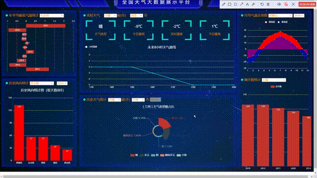

# Weather Big Data Display Platform（[Chinese Version Link / 中文Readme链接](https://github.com/xiangwentao666/National-Weather-Big-Data-Display-Platform-Based-on-SpringBoot-and-Vue/edit/main/README_Chinese.md)）
## National Weather Big Data Display Platform Based on SpringBoot and Vue
## (The code was completed in November 2022 and it is coming soon!)
### Overview
This is an open-source project for a nationwide weather big data display platform, based on SpringBoot and Vue, encompassing two systems: a distributed weather data collection system and a weather big data presentation system.

#### Distributed Weather Data Collection System
The distributed weather data collection system employs Python for the client-side and SpringBoot for the server-side, with the server deployed on Alibaba Cloud servers. When a client initiates a connection, the server retrieves pending collection tasks from the server's database and assigns them to the connecting client. Upon receiving a task, the client carries out the data collection. Once completed, the collected data is organized into JSON format and transmitted back to the server for storage, after which the next task is assigned.

#### Data Analysis
After the data collection is finished, data analysis is performed using technologies such as HDFS, Hadoop, and Hive.

**ATTENTION**: Data compressed in a zip file named "weather_dataset.zip" can be downloaded from my github repository, and [here is the link](https://github.com/xiangwentao666/National-Weather-Big-Data-Display-Platform-Based-on-SpringBoot-and-Vue/blob/main/weather_dataset.zip).

#### Data Visualization via a Website Application
Following the analysis, the results are visually presented using SpringBoot and Vue.

*Welcome to fork this project and actively raise issues, hoping it could be helpful to everyone!*

**NOTE**: This project is **MERELY AN ASSIGNMENT** for one of my courses!

### Interacting Video Demo

  
  

## Other Repositories Recommendation
### Intelligent Fitness Guidance System Based on Posture Estimation and Segmentation Algorithms.[link](https://github.com/xiangwentao666/FitnessGuidanceSystem)
This is a fitness project based on MediaPipe and rPPG that integrates skeletal keypoint recognition, heart rate detection, and physical training. A desktop application and a WeChat mini-program are developed for exercising and fitness knowledge quizzes, respectively. Additionally, it achieves interconnectivity and data exchange between the two platforms.

**NOTE**: ONLY a part of my **INDIVIDUAL UNDERGRADUATE THESIS** for university graduation!
 

  
  

